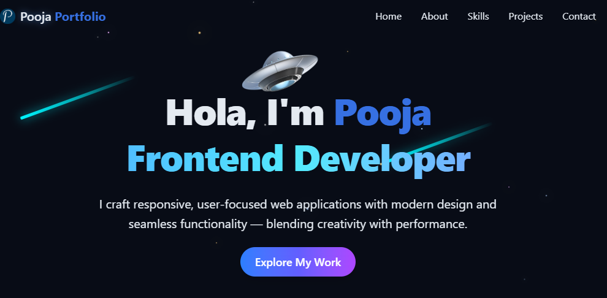

# 🌐 Pooja Portfolio  

<div align="center">
  <br />
  
  <br /><br />
  <div>
    
    
    
    
    
  </div>
  <h3 align="center">My Personal Developer Portfolio Website</h3>
  <br />
</div>  

---

## 📌 About  

This is my **personal portfolio website**, built to showcase my skills, projects, and achievements as a **Frontend Developer**.  
The site highlights my background, technical expertise, and the projects I’ve worked on, all wrapped in a clean and modern UI with animations and dark mode support.  

🔗 Live Website: **[Portfolio Website](https://pooja-portfolio.vercel.app/)**  

---

## ⚙️ Tech Stack  

- ⚛️ **React** – Component-based UI development  
- ⚡ **Vite** – Fast and optimized build tool  
- 🎨 **TailwindCSS** – Utility-first styling  
- 🔔 **Lucide Icons** – Modern icon pack  
- 🎛️ **Radix UI** – Accessible UI components  
- ☁️ **Vercel** – Deployment & hosting  

---

## ✨ Features  

- 🌑 **Dark Mode** for developer friendly view
- 💫 **Subtle Animations** for sections and UI elements  
- 📱 **Responsive Design** (desktop, tablet, mobile)  
- 👩‍💻 **Hero & About Section** introducing me as a developer  
- 📊 **Skills Showcase** highlighting technologies I use  
- 🖼️ **Projects Section** with live links & GitHub repos  
- 📩 **Contact Section** with email and social links  

---

## 🚀 Getting Started  

### Clone and Run  

```bash
git clone https://github.com/Pooja-so/Pooja-Portfolio.git
cd Pooja-Portfolio
npm install
npm run dev
